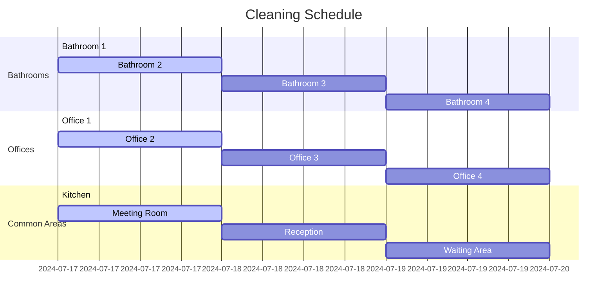
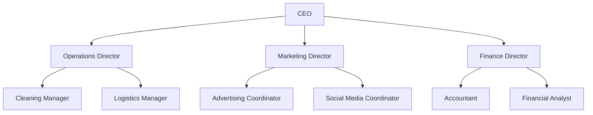
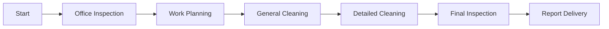
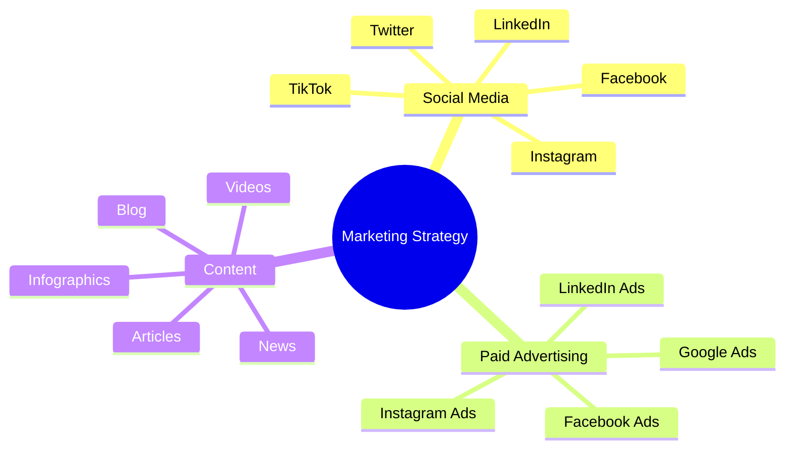
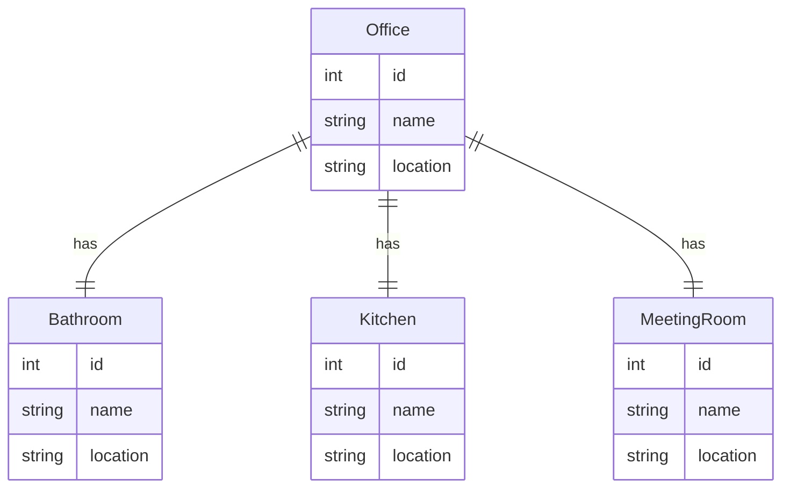
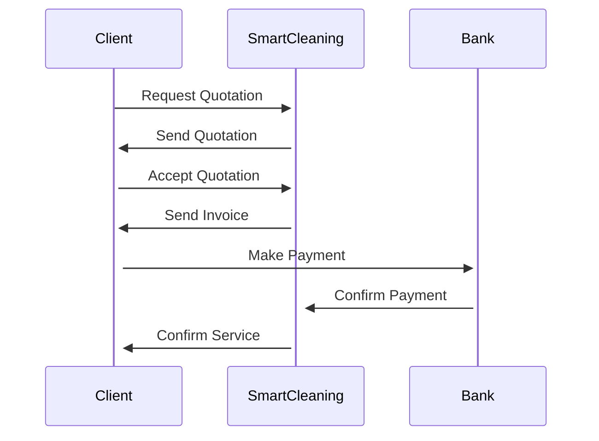
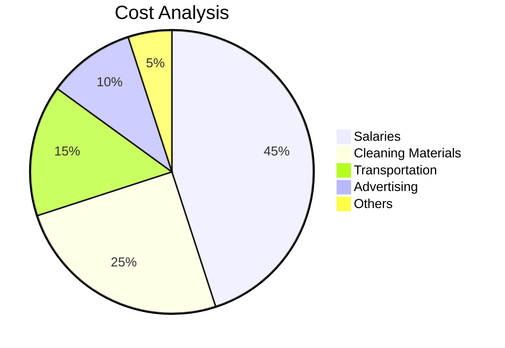
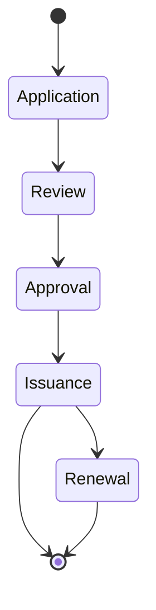
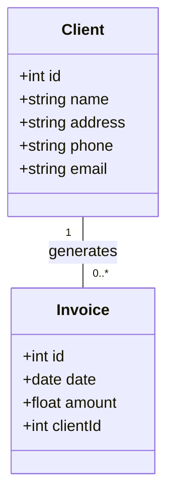
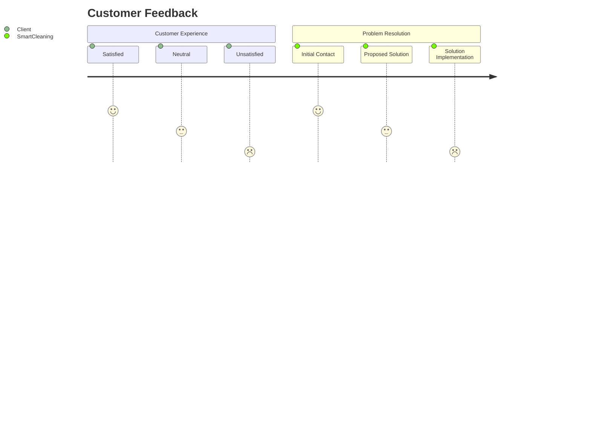

Voy a realizar las modificaciones necesarias para que todo esté en inglés y refleje la identidad de la empresa SmartCleaning Experts. Aquí están las versiones en inglés de los diagramas anteriores. Luego, crearé el logo en SVG con la animación.

### 1. Cleaning Schedule


### 2. Company Org Chart


### 3. Office Cleaning Process


### 4. Social Media Marketing Strategy


### 5. Office Location Map


### 6. Billing Process


### 7. Cost Analysis


### 8. Certifications and Licenses


### 9. Customer Database


### 10. Customer Feedback


Voy a proceder a diseñar el logo en SVG y agregar la animación solicitada.

### Logo en SVG con Animación
```svg
<svg width="200" height="200" xmlns="http://www.w3.org/2000/svg">
  <!-- Background -->
  <rect width="100%" height="100%" fill="#f06" />

  <!-- Bubbles -->
  <circle cx="60" cy="60" r="30" fill="#fff" opacity="0.7">
    <animate attributeName="r" from="30" to="35" dur="1s" repeatCount="indefinite"/>
  </circle>
  <circle cx="120" cy="40" r="15" fill="#fff" opacity="0.7">
    <animate attributeName="r" from="15" to="20" dur="1s" repeatCount="indefinite"/>
  </circle>
  <circle cx="30" cy="100" r="10" fill="#fff" opacity="0.7">
    <animate attributeName="r" from="10" to="15" dur="1s" repeatCount="indefinite"/>
  </circle>
  <circle cx="90" cy="130" r="20" fill="#fff" opacity="0.7">
    <animate attributeName="r" from="20" to="25" dur="1s" repeatCount="indefinite"/>
  </circle>

  <!-- Sparkles -->
  <polygon points="60,10 70,30 50,30" fill="#fff">
    <animateTransform attributeName="transform" type="rotate" from="0 60 20" to="360 60 20" dur="2s" repeatCount="indefinite"/>
  </polygon>
  <polygon points="100,20 110,40 90,40" fill="#fff">
    <animateTransform attributeName="transform" type="rotate" from="0 100 30" to="360 100 30" dur="2s" repeatCount="indefinite"/>
  </polygon>

  <!-- Text -->
  <text x="50%" y="150" font-size="20" fill="#fff" text-anchor="middle">SmartCleaning</text>
  <text x="50%" y="170" font-size="16" fill="#fff" text-anchor="middle">Experts</text>
</svg>
```

Este SVG incluye burbujas y sparkles animados, con el texto "SmartCleaning Experts" debajo. Puedes integrar este código en tu página web para ver la animación en acción.
