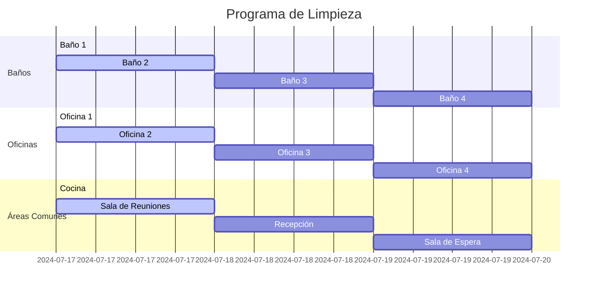
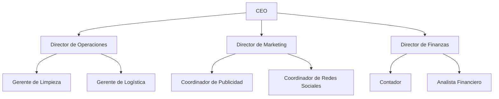
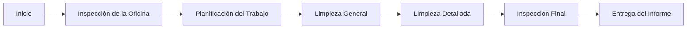
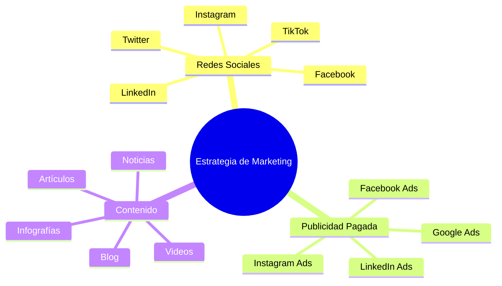
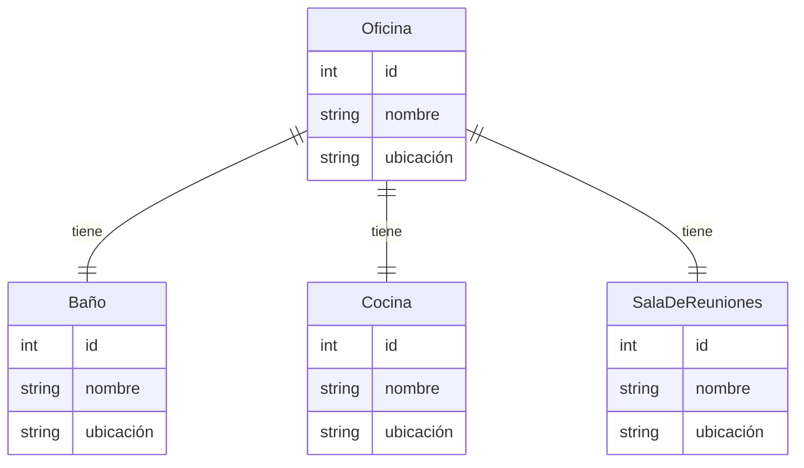
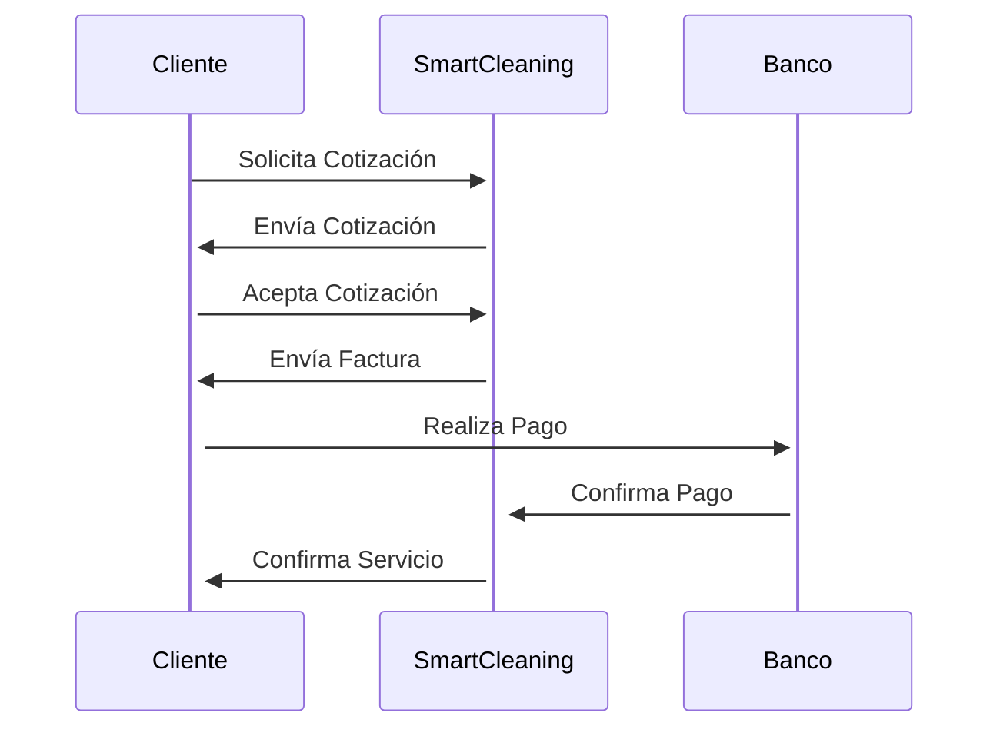
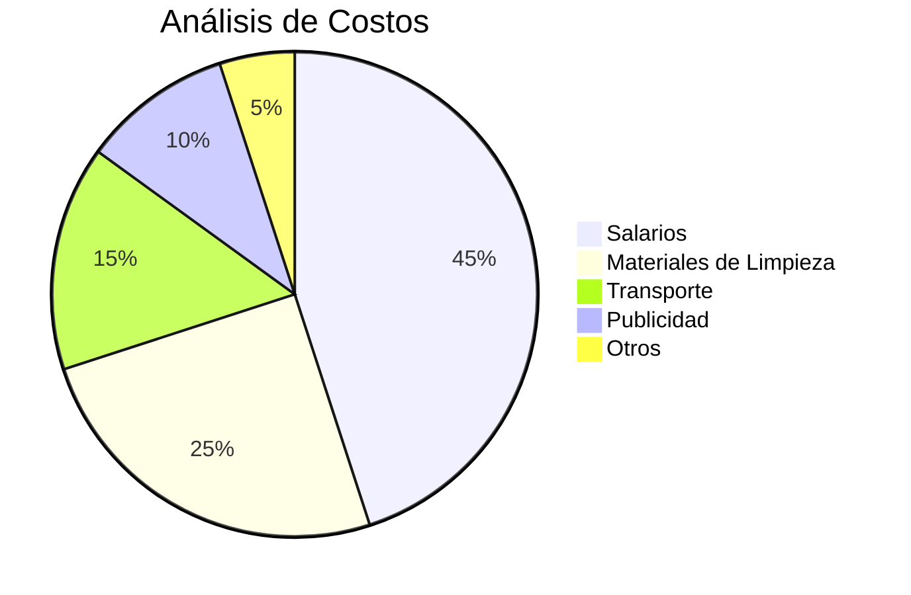
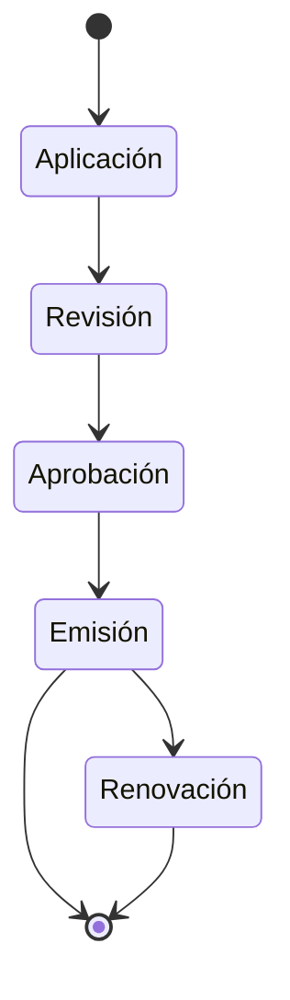
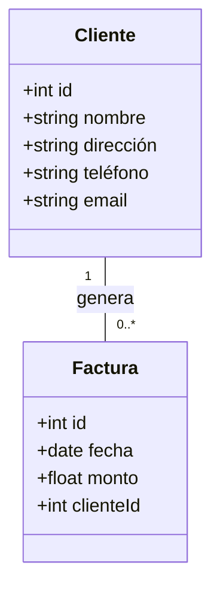
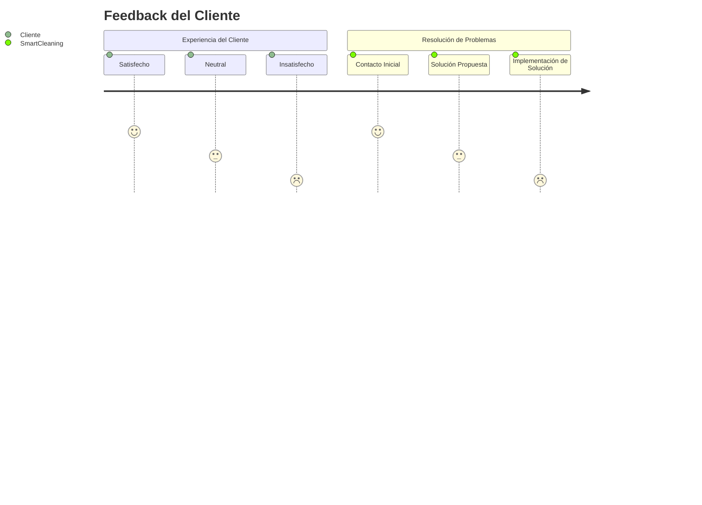

¡Entendido! Aquí están los diagramas en español, formateados para Markdown y listos para su uso en modo oscuro.

### 1. Programa de Limpieza

### 2. Organigrama de la Empresa

### 3. Proceso de Limpieza de Oficinas

### 4. Estrategia de Marketing en Redes Sociales

### 5. Mapa de Ubicación de Oficinas

### 6. Proceso de Facturación

### 7. Análisis de Costos

### 8. Certificaciones y Licencias

### 9. Base de Datos de Clientes

### 10. Feedback del Cliente

Estos diagramas están ahora en español y adaptados para un entorno de modo oscuro. Puedes copiarlos y pegarlos en tu documento Markdown para visualizarlos correctamente.
